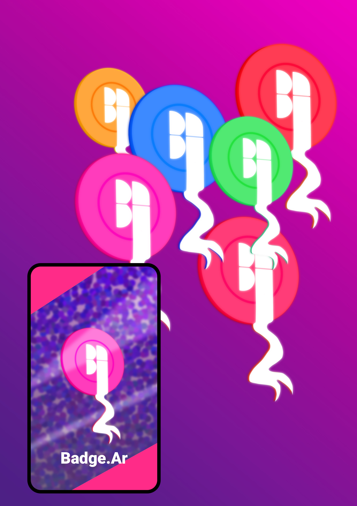

<h1>Badge.ar</h1>

> Create NFTs from your achievements.

## Overview

We build a platform to mint NFTs from achievements.
In this mvp we can use achievements from our steam account,
but we hope in the future to add many other providers :D

In order to achieve this we use appwirte as a backend for
the interaction between our frontend 
and our nodes connected to the cardano blockchain.

What inspired us to do this was the idea of having a centralized place to store our
of having a decentralized place to store our achievements,
badges, awards from different platforms and to make these achievements
be more than just a badge within the platforms where we get them.

### Submission Category: 
Web3 Wunderkinds

### Link to Code
``

### Additional Resources / Info
[Note:] # (Be sure to link to any open source projects that are using your workflow!)
Docker
Appwrite
Cardano nodes and cli
NFTStorage

[Note:] # Screenshots/demo videos are encouraged!

DEV Usernames:
@gabmetal
@catrielmuller
@matiasgf